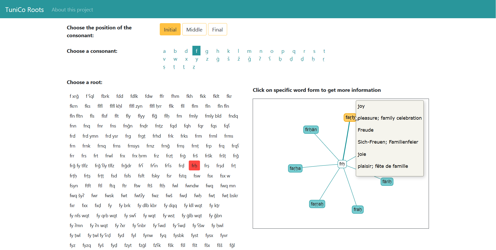

# TuniCo Roots

This web application was created as a part of the ACDH hackathon 2019 ELEXIS.
It was implemented with BaseX and RESTXQ. The provided dataset is stored in the database. For the interaction, JavaScript, jQuery and vis.js was used. Bootstrap 4 is the CSS framework.

The application provides insights to the dataset by choosing radical consonants and roots.

## Prerequisites

1. Install BaseX
2. Start the BaseX server
3. Open <http://localhost:8984/dba/login> in the browser (default login password and user `admin`)
4. Click *Databases* > *Create...* 
5. Enter the database name *hackathon19*
6. Click *Create*
7. Click *Add...* 
8. Click *Browse* and choose the file *dc_aeb_eng.xml*
9. Click *Add*  
The file was added to the hackathon database.

Add the following files and directories to the BaseX webapp directory:

1. Add *tunico.xqm* to `BaseX/webapp/`  
(Note: Other *.xqm* files with identical paths could lead to conflicts.)

2. Add *tunico* directory to `BaseX/webapp/static/`

## Open the web application

1. Start the BaseX server
2. Open <http://localhost:8984/tunico> in the browser

An internet connection is needed to fetch libraries per content delivery network.

### Additional information

For customizing the appearance, Sass was used. The *.scss* file is included in this repository.
